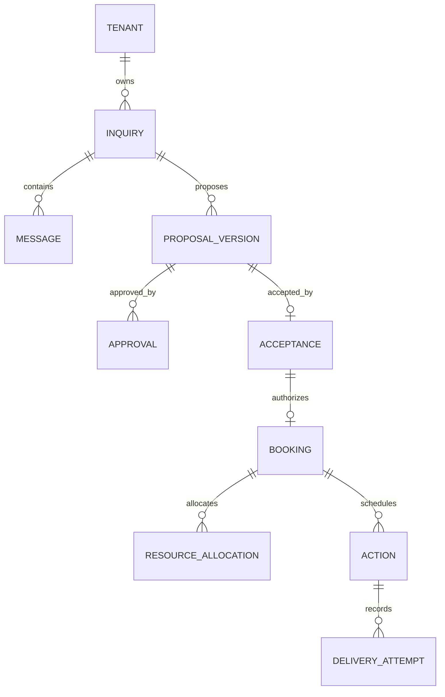
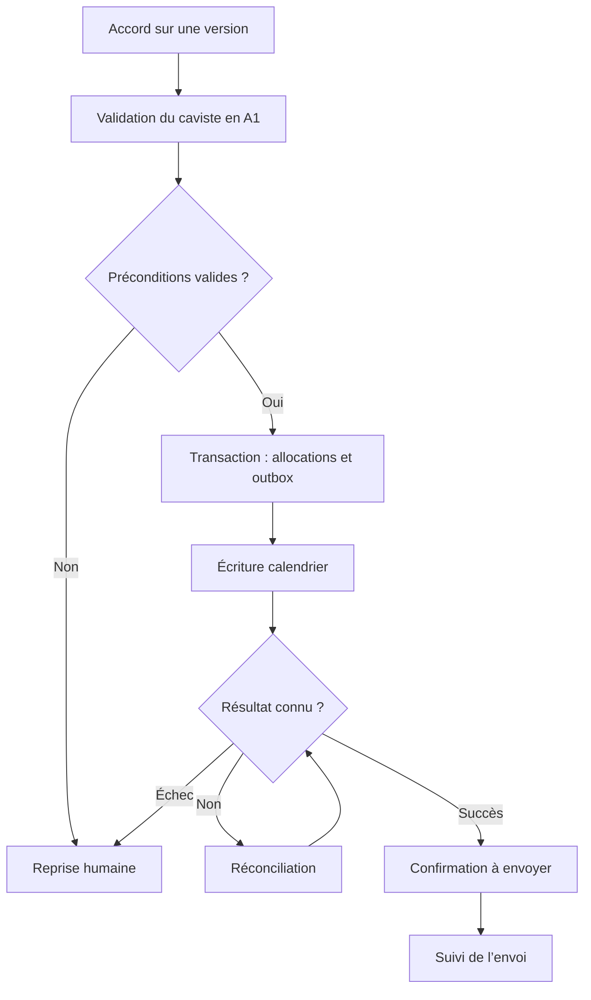

# Contrats de développement proposés

Version 1.0 — exemples à implémenter et valider ; aucune route de production n’existe encore dans le POC.

## Commande de réservation

En A1, le clic « Réserver et confirmer » enregistre d’abord une autorisation via la commande proposée POST /v1/proposals/{id}/booking-approvals. Elle exige un acteur habilité, la version attendue et l’accord exact, puis retourne booking_approval_id. L’autorisation comporte sa portée, son acteur, sa date et sa validité ; le serveur la revérifie au moment de réserver.

```json
{
  "proposal_version_id": "uuid-version-acceptee",
  "acceptance_id": "uuid-preuve-accord",
  "booking_approval_id": "uuid-autorisation-humaine",
  "expected_inquiry_version": 7
}
```

En-têtes : Idempotency-Key, identité authentifiée et corrélation serveur. Le serveur résout la cave et relit montants, ressources, dates et destinataires dans l’instantané accepté. Aucun tenant ou prix proposé par l’appelant n’est une autorité. En A1, booking_approval_id référence une autorisation humaine créée après accord, liée à cette version et couvrant la réservation et sa confirmation. Le serveur contrôle son acteur, sa portée et sa validité ; le champ seul ne vaut pas autorisation.

Réponse de planification (202) :

```json
{
  "booking_id": "uuid-reservation",
  "action_id": "uuid-action",
  "booking_status": "sync_pending",
  "status_url": "/v1/actions/uuid-action"
}
```

Même clé et même charge : même résultat. Même clé avec autre charge : 409. Accord obsolète, version modifiée ou allocation conflictuelle : 409 avec code métier stable. Aucune confirmation client n’est impliquée par cette réponse.

## Résultat d’extraction IA

```json
{
  "intent": "activity_request",
  "language": "fr",
  "party_size": {"value": 15, "status": "explicit", "source_message_id": "msg-01"},
  "date": {"value": null, "status": "needs_confirmation", "original_text": "samedi prochain"},
  "budget": {"amount_minor": 8000, "currency": "CHF", "unit": "per_person"},
  "missing_fields": ["confirmed_date"],
  "contradictions": [],
  "needs_human_review": false
}
```

Ce JSON est un exemple, pas un schéma strict exhaustif. À l’implémentation, définir un JSON Schema fermé et versionné pour tous les champs, nulls, énumérations et bornes. Refus fournisseur, sortie tronquée et erreur de parsing sont des résultats distincts. Le serveur vérifie l’existence des messages sources et toutes les références d’offres.

## Événement d’outbox

```json
{
  "event_id": "uuid-evenement",
  "tenant_id": "uuid-interne-resolu-par-serveur",
  "type": "BookingSyncRequested",
  "aggregate_id": "uuid-reservation",
  "aggregate_version": 3,
  "idempotency_key": "booking:uuid-reservation:sync:v3",
  "payload_version": 1
}
```

Ne pas sérialiser les jetons OAuth. Le worker recharge les informations nécessaires selon le tenant autorisé. Tâche : état, bail, tentatives, échéance, date de reprise, résumé d’erreur et référence de résultat.

## Contrainte PostgreSQL indicative

```sql
CREATE EXTENSION IF NOT EXISTS btree_gist;
CREATE TABLE resource_allocations_example (
  id uuid PRIMARY KEY,
  tenant_id uuid NOT NULL,
  resource_id uuid NOT NULL,
  starts_at timestamptz NOT NULL,
  ends_at timestamptz NOT NULL,
  state text NOT NULL CHECK (state IN ('held', 'confirmed', 'released')),
  CHECK (ends_at > starts_at),
  EXCLUDE USING gist (
    tenant_id WITH =,
    resource_id WITH =,
    tstzrange(starts_at, ends_at, '[)') WITH &&
  ) WHERE (state IN ('held', 'confirmed'))
);
```

Exemple isolé, non migration finale : ajouter les clés étrangères composites vers tenant/ressource/réservation, la stratégie d’accès, l’historique et les index nécessaires. Les bornes incluent les marges. Libérer explicitement les options expirées. Une transaction alloue toutes les ressources. Cette contrainte n’empêche pas une saisie indépendante dans Outlook.

## Variables de configuration à prévoir

DATABASE_URL, OIDC_ISSUER, OIDC_CLIENT_ID, OIDC_CLIENT_SECRET, TOKEN_ENCRYPTION_KEY_REFERENCE, MICROSOFT_CLIENT_ID, MICROSOFT_CLIENT_SECRET_REFERENCE, MICROSOFT_WEBHOOK_BASE_URL, AI_PROVIDER, AI_MODEL_ID, AI_API_KEY_REFERENCE, APP_BASE_URL, JOB_LEASE_SECONDS et ENVIRONMENT.

Ce sont des noms proposés, pas des secrets ou comptes à réutiliser. Les connexions et refresh tokens sont propres aux caves, chiffrés et stockés côté serveur. Les IDs de tenant interne et de tenant Microsoft sont différents.

## Relations principales



Schéma conceptuel simplifié : le modèle final permet les refus, expirations, variantes, modifications et plusieurs preuves d’acceptation lorsque nécessaire. Ne pas imposer les cardinalités simplifiées sans revue métier.

## Orchestration de réservation



La boucle de réconciliation est bornée : délai, nombre d’essais et passage humain. Le chemin « succès » suppose que les règles de ressources externes satisfont la politique de la cave.
